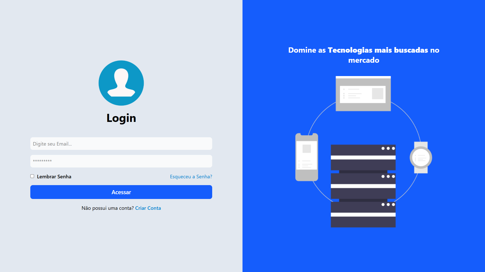
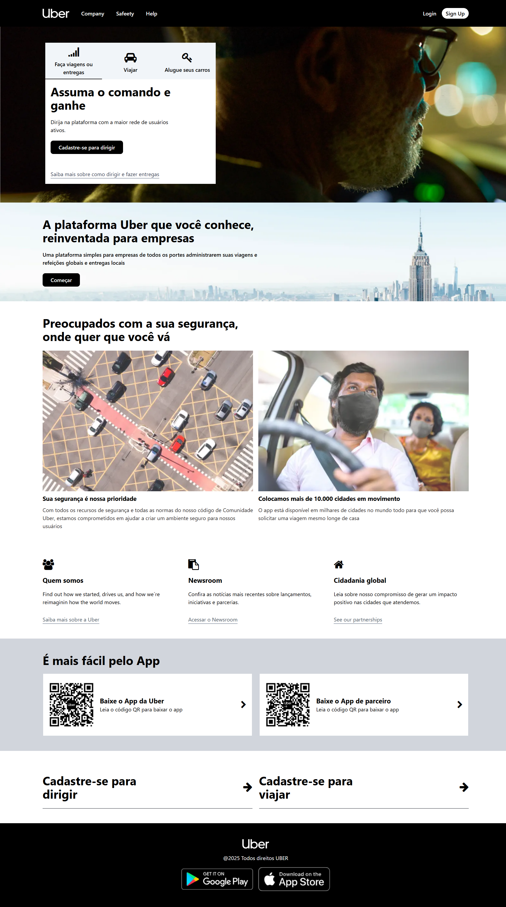
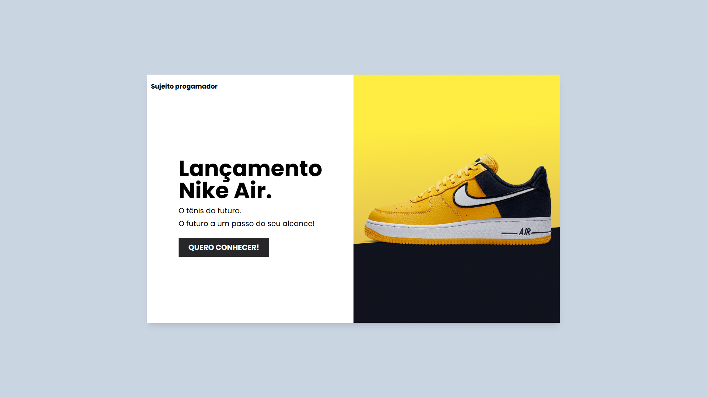

# 🌬️ Tailwind CSS - Estudo e Prática

Este repositório reúne projetos desenvolvidos durante meus estudos com **Tailwind CSS**. Aqui, exploro conceitos fundamentais da biblioteca e aplico o conhecimento em pequenos projetos práticos, todos **100% responsivos**.

## 📚 Tecnologias Utilizadas

  
  
  

## 📂 Projetos

### 🔐 Tela de Login Responsiva
Uma tela de login simples e elegante, com foco em responsividade e layout moderno.

---

### 🚗 Clone da Página Inicial da Uber
Réplica da página inicial do site da Uber, com foco em layout responsivo, imagens de fundo e design limpo.

---

### 👟 Anúncio Nike Air
Projeto de anúncio de tênis Nike, com animações e design atrativo para e-commerce.

---

### 🏡 DevHouse - Estilo Airbnb
Mini landing page inspirada em plataformas como Airbnb, com visual clean e disposição intuitiva.

---

## 💡 Objetivo

O principal objetivo deste repositório é consolidar conhecimentos em **Tailwind CSS** com exemplos práticos e reais, fortalecendo minha base em desenvolvimento front-end responsivo.

---

## 🚀 Sinta-se à vontade para explorar os projetos e utilizar como referência!